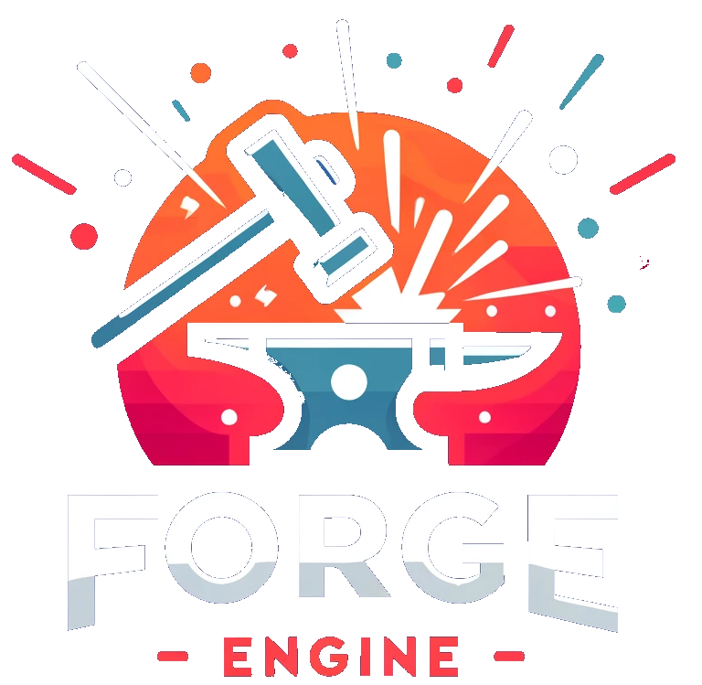

  

# Forge
A game engine which purpose is to be a sandbox for various algorithms a.k.a. educational purposes.

### Goals:
- As less external code as possible (as long as it makes sense/it's not boring to implement) - hence no helpers like DirectXTK
- OOP and DOP hybrid - ECS where it makes sense.
- Long term project with slow, but constant progress.

#

Unit Tests have been moved to separate, private submodule. They're obviously not needed to run an application.

### Current state:

# v0.04

- ECS 2.0
- Debug shapes + drawing wireframe
- Animation component + system
- Physx integration
- Finally... skybox

# v0.03
YouTube video :  

- Spot lights and directional lights
- Orthographic camera
- Shadows for point, spot and directional lights
- Alpha blending
- Self made RTTI
- FBXes loading
- Skeletal animations

# v0.02

- Deferred shading
- IMGUI debug with G-Buffer preview
- Smooth runtime switch between Forward<->Deferred mode thanks to one, macro based Uber shader
- Separate rendering passes for Opaque, Transparent (not implented yet) and Non-lit (for drawing in-world debugs) objects

# v0.01

- ECS Systems, Components and Entities
- Forward rendering
- Ambient + point light with blinn-phong
- Loading obj models (using tinyobj), materials and diffuse textures
- Self-implemented math
- Imgui integration
- Tracy integration
- D3D11 API completely decoupled from engine
